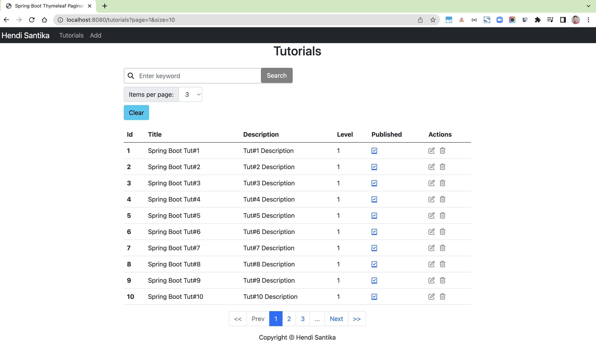
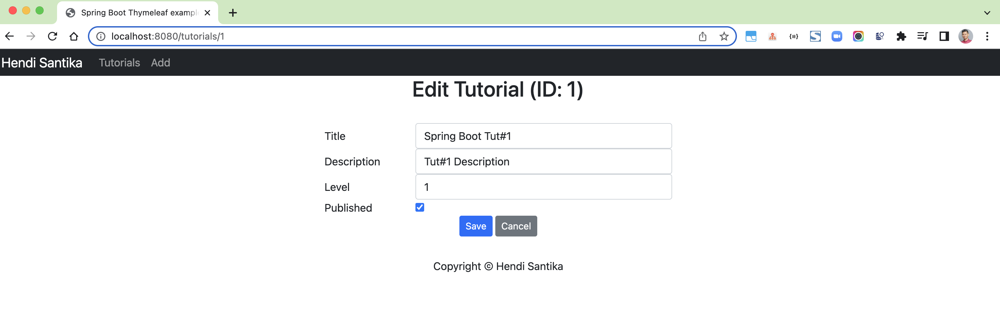

# spring-boot-thymeleaf-pagination

### Things todo list

1. Clone this repository: `git clone https://github.com/hendisantika/spring-boot-thymeleaf-pagination.git`
2. Navigate to the folder: `cd spring-boot-thymeleaf-pagination`
3. Run the application: `mvn clean spring-boot:run`
4. Open your favorite browser: http://localhost:8080/tutorials

## Image Screen shot

List All tutorials

Add New Tutorial

